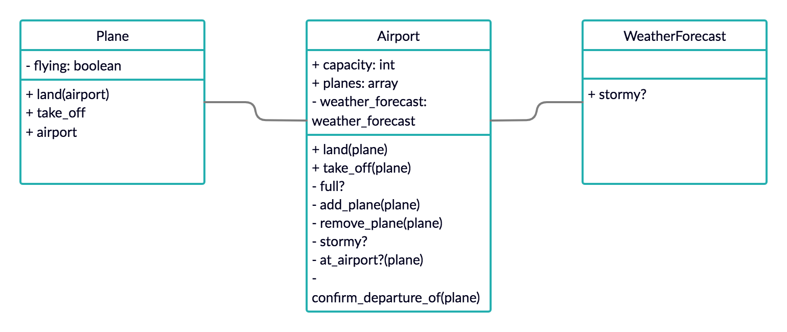

# Airport
Object based system to control the flow of planes at an airport. The planes can land and take off provided that the weather is sunny. Occasionally it may be stormy, in which case no planes can land or take off.

## Table of Contents
* [Code Quality](#code-quality)
* [Technologies](#technologies)
* [Getting Started](#getting-started)
* [Testing](#testing)
* [Domain Model](#domain-model)
* [Principles and takeaways](#principles-and-takeaways)
* [Analysis](#analysis)
* [Author](#author)

## Code Quality
[](https://codeclimate.com/github/xelAhcratiPsavilO/airport/maintainability)

## Technologies
- Main technology
  - [Ruby](https://www.ruby-lang.org/en/) - High-level, general-purpose language utilized as main technology.
- Unit Test
  - [RSpec](https://rspec.info/) - Domain specific language utilized as testing tool.
- Feature Test
  - [IRB](https://en.wikipedia.org/wiki/Interactive_Ruby_Shell) - Interactive ruby shell utilized as a REPL.
- Documentation
  - [MD](https://www.markdownguide.org/) - Lightweight markup language utilized for documentation.

## Getting Started

Follow the instructions below to clone the repository and run it locally for testing and development demonstrations.

### Prerequisites
- Verify that a current version of Ruby is installed:
```bash
ruby -v
```

### Installing
- Clone the repository:
```bash
git clone git@github.com:xelAhcratiPsavilO/airport.git
```
- Launch irb, pry or other ruby REPL:
```bash
irb
```
### Running
- Load the Plane class (similarly for any other class):
```bash
> require './lib/plane'
=> true
```
- Create a new Airport instance (similarly for any other class):
```bash
> airpot = Airport.new
=> #<Airport:0x00007f8aee176d50>
```

### Testing
- Launch RSpec to verify that all tests are passing:
```bash
rspec
```
- Expected output:
```bash
....
Finished in 0.10001 seconds (files took 0.59693 seconds to load)
34 examples, 0 failures
```

## Domain Model

High-level overview of the entities that make up this functional system.



Based on [client's requirements](USER_STORIES.md).

Objects-Messages [diagram](DIAGRAM.md).

## Principles and takeaways
Symbols are preferred over strings literal since the latter creates a new string object in memory every time is interpreted, symbols are a more efficient solution. Stubbing methods by allowing Kernel to output certain values makes possible to test randomness. Explicitly defining a name subject, whenever possible, reduces code smell. Before-block statements allow to group functionality based on conditions. Context and describe create subsets of scope organized by behavior which helps maintaining the readability of the logs. Avoiding vacuous tests ensures that all tests are functional.

## Analysis
Currently, the Airport class contains a considerable amount of the system functionality, creating a one to one relationship with a fourth class such as ControlTower would have been worth discussing with the client.
It would have been interesting researching the possibility (or not) of making some methods protected, instead of public or private, to allow some Classes to use them but prevent the user access to them.
Researching the possibility of a different syntax for methods that receive two arguments would have increase the readability of such methods.

## Author

Alejandro Pitarch Olivas
